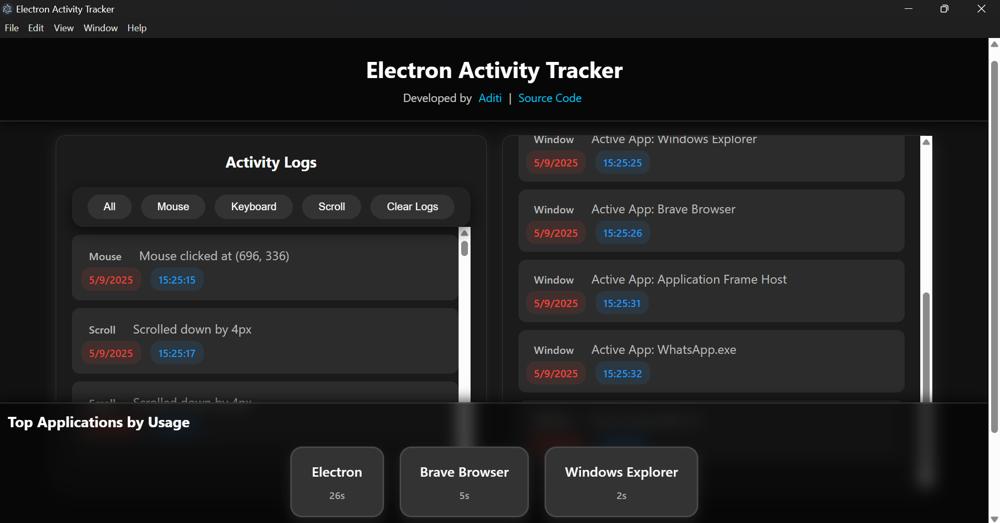

# electron-activity-tracker
Watches what you do on your computer.
Track and visualize user activity (keyboard, mouse, scroll, and window focus) in real-time using Electron.

## 📌 Features

- ✅ Real-time tracking of **mouse**, **keyboard**, and **scroll** events
- ✅ Logs and filters activity by type
- ✅ Captures **active window changes**
- ✅ Displays most-used apps in a sleek dashboard
- ✅ Stylish UI with **dark mode** and responsive design

---

## 🛠️ Tech Stack

- [Electron](https://www.electronjs.org/)
- HTML, CSS (with custom styling)
- Vanilla JavaScript
- [`active-win`](https://www.npmjs.com/package/active-win) for window tracking

---

## 🧩 How It Works

1. Electron app launches a `BrowserWindow`.
2. Renderer process logs all mouse/keyboard/scroll events.
3. `active-win` (used in the main process) polls current focused app and updates usage.
4. Data is displayed live in the frontend with visual filters and dashboards.

---